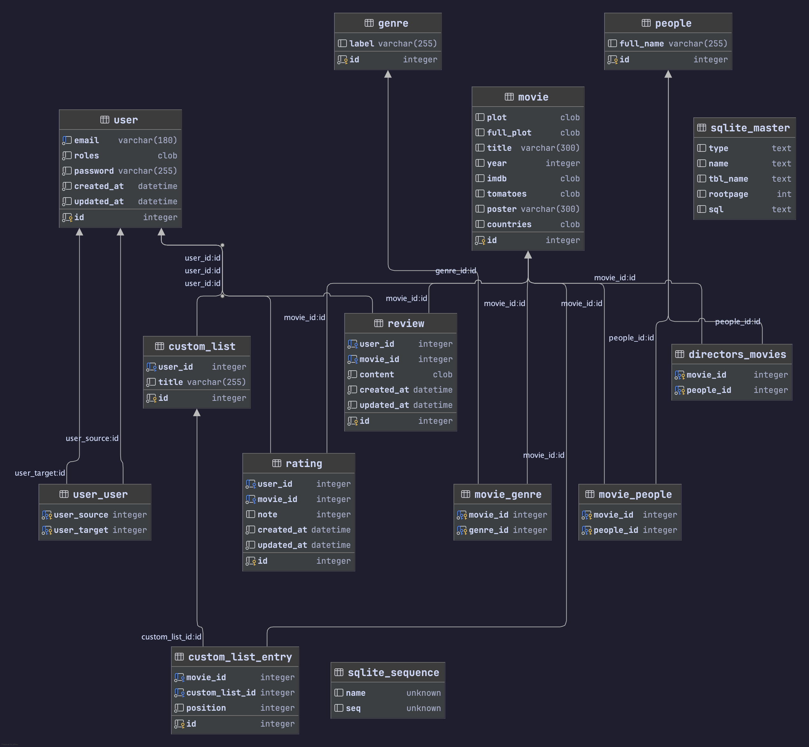

# movies-api

> Une API développée avec Symfony centrée autour de films

## :sparkles: Fonctionnalités

- listings de films et recherche par titre. Il est aussi possible de lister les films par
  - genre
  - acteur
  - réalisateur
- créer un compte et
  - noter des films
  - écrire des critiques de films
  - ajouter des films à des collections personnelles
  - suivre d'autres utilisateurs et voir leurs notes / critiques / collections

## Setup du projet

### En local

```bash
composer install
symfony serve # requires Symfony CLI (https://symfony.com/download)
```

### Avec Docker

```bash
docker compose up php
```

## :books: Documentation

La base de données est en SQLite et se trouve dans le dossier `db`. Elle contient plus de 20000 films.



Toutes les requêtes API dont avez besoin se trouvent dans le fichier `api.http`.
Vous pouvez les exécuter nativement avec PHPStorm, ou avec le plugin `HttpYac` de VSCode : https://marketplace.visualstudio.com/items?itemName=anweber.vscode-httpyac.

La documentation OpenAPI est accessible à cette URL : http://127.0.0.1:8000/api.

Les requêtes `GET` pour les collections acceptent des query parameters pour la pagination :
- `page` pour la page à requêter,
- `itemsPerPage` pour le nombre d'items à retourner pour chaque page.

Pour le `POST` ou le `PATCH` de ressources avec des relations, il faudra préciser l'IRI complète de la ressource à lier et pas seulement l'id, par exemple `/api/movies/1`.

Quelques utilisateurs ont déjà été créés pour tester la connexion, avec un id de 1 à 9 :
- email : `test<id>@test.com`
- password: `password`

## Développement et contribution

Pour réinitialiser la base de données, lancer cette commande :

```bash
bin/console d:d:d --force && bin/console d:d:c && bin/console d:s:u --force && bin/console app:init
```

Pour rebuild l'image docker, utiliser cette commande :

```bash
docker compose build --no-cache
```

